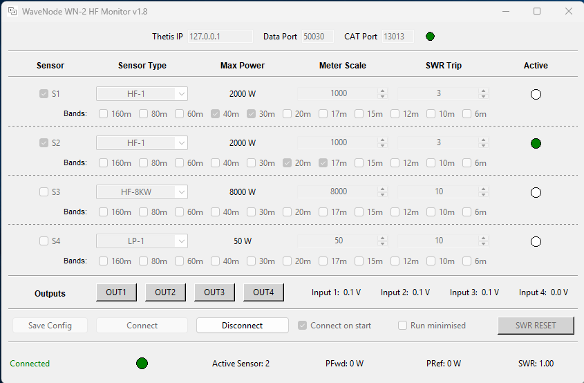

# Wavenode
Wavenode WN-2d to Thetis Bridge

Allows data from WN-2d to be used in Thetis Multimeter I/O, and allows Thetis to control WN-2d logic outputs and reset SWR trip

Automatic selection of Wavenode sensors by band

##Screenshot

1
